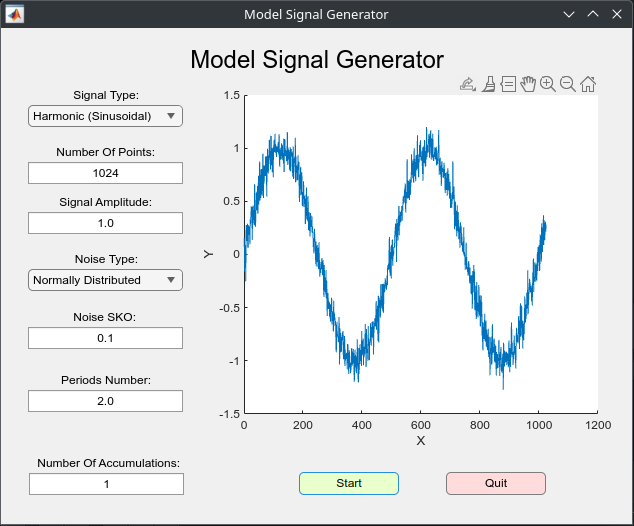
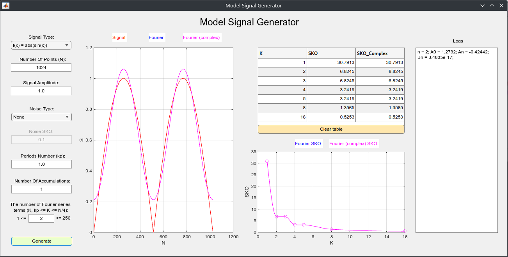
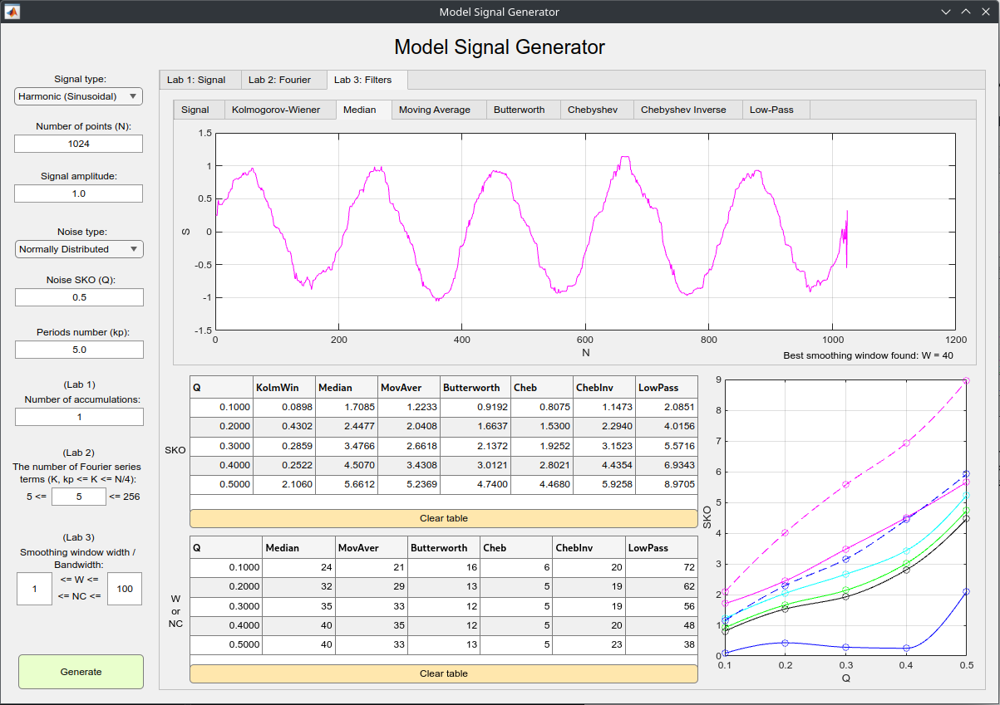

# politech-labs-matlab

Лабораторные работы по предмету "Применение методов искусственного интеллекта для цифровой обработки сигналов" (универ, 5-й семестр).

Для написания работ использовался MATLAB 2024a с установленными пакетами (для них приведены функции, для которых и потребовался этот пакет):

- `Simulink`;
- `Deep_Learning_Toolbox`;
- `Parallel_Computing_Toolbox`;
- `Signal_Processing_Toolbox`:
  - `sawtooth`;
  - `square`.
- `Communications_Toolbox`:
  - `wgn`.
- `Curve_Fitting_Toolbox`:
  - `spaps`.

## Лабораторная работа 1

## Лабораторная работа 2

## Лабораторная работа 3

